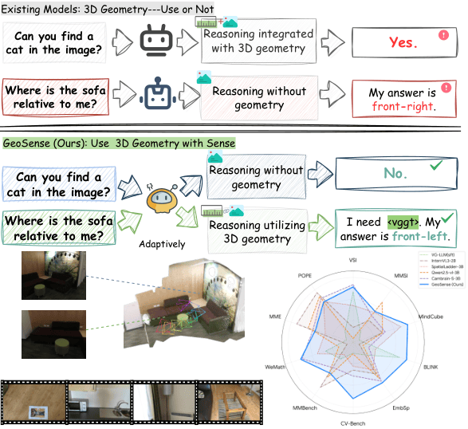
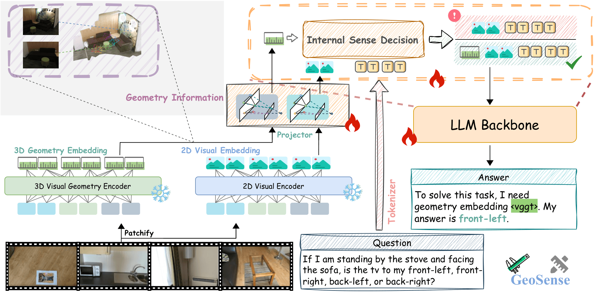

# GeoSense: Internalizing Geometric Necessity Perception for Multimodal Reasoning

[](https://water-wood-rain.github.io/Geosense/)
[](https://huggingface.co/Henry012/GeoSense)
[](https://github.com/Water-Wood-Rain/Geosense)
[](https://huggingface.co/Henry012/GeoSense)

GeoSense is a multimodal reasoning framework that teaches MLLMs to decide when 3D geometry is actually necessary. Instead of rigidly injecting geometric features into every input, GeoSense keeps geometry as an independent, on-demand information channel and invokes it only when standard 2D visual perception is insufficient.

- Project page: https://water-wood-rain.github.io/Geosense/
- Model checkpoint: https://huggingface.co/Henry012/GeoSense
- Repository: https://github.com/Water-Wood-Rain/Geosense
- Paper PDF: [assets/geosense_icml2026.pdf](assets/geosense_icml2026.pdf)

## News

- 2026-05-21: Initial GeoSense source release.
- 2026-05-21: GeoSense model checkpoint is available on Hugging Face.

## Overview

Current spatial MLLMs often use a tightly coupled design: they either ignore geometric information or fuse it into every sample. This is inefficient and can be harmful, because geometry is not universally useful. Some tasks require precise 3D cues, while OCR, chart reasoning, object recognition, or general VQA may be degraded by unnecessary geometric signals.

GeoSense addresses this with an internal geometry-necessity mechanism:

1. A standard 2D visual encoder and a 3D geometry encoder are kept as separate feature sources.
2. Dedicated projectors align 2D and 3D features into the MLLM embedding space.
3. The model first reasons from text and 2D visual input.
4. If its internal state determines that geometric information is needed, it emits a geometry trigger token, `<vggt>`.
5. The system then performs a geometry-aware second pass with 3D embeddings; otherwise it keeps the geometry channel closed.

<p align="center">
  <a href="https://water-wood-rain.github.io/Geosense/">
    
  </a>
</p>

## Method

GeoSense uses a two-stage training pipeline.

### Independent Geometry Adaptation

GeoSense uses Qwen2.5-VL as the base multimodal model and VGGT-1B as the 3D geometry foundation model. Unlike additive or always-on fusion, GeoSense treats geometry as an independent input sequence. The 2D visual encoder and 3D geometry encoder are frozen, while projection layers and the LLM backbone are optimized so geometry tokens can be interpreted in the same multimodal embedding space.

### Spatial-Aware Supervised Fine-Tuning

The second stage activates internal spatial awareness. GeoSense is trained to decide whether a sample needs geometry by learning from dual-condition inference: predictions are compared with and without geometry features. Samples where 3D cues are essential are converted into training signals that request geometry through `<vggt>`, while samples where geometry behaves as noise are used to teach suppression of the geometry channel.

<p align="center">
  
</p>

## Results

GeoSense is evaluated on both spatial reasoning and general visual reasoning benchmarks. The goal is not only to improve spatial tasks, but also to preserve general multimodal reasoning when geometry is unnecessary.

| Model | Spatial Avg. | General Avg. | Overall Avg. | Notes |
| --- | ---: | ---: | ---: | --- |
| Qwen2.5-VL-3B | 43.4 | 53.3 | 48.3 | Base MLLM |
| Qwen2.5-VL-7B | 50.5 | 57.8 | 54.1 | Larger general baseline |
| VG-LLM | 49.7 | 52.0 | 50.9 | Always-on geometry fusion |
| GeoSense | **56.6** | **55.2** | **55.9** | Adaptive geometry usage |

On the reported benchmark suite, GeoSense reaches the best overall average while improving spatial reasoning without collapsing general visual capability. The ablation study also shows that adaptive geometry insertion uses geometry for only part of the data while outperforming always-on fusion on key spatial tasks.

## Installation

Create the public release environment named `geos`:

```bash
conda create -n geos python=3.10
conda activate geos
pip install -r requirements.txt
pip install -e . --no-deps
```

The implementation expects CUDA-capable GPUs for training and multi-GPU evaluation. The training scripts were developed for distributed execution with `torchrun` and DeepSpeed.

## Model Checkpoint

Download the released checkpoint from Hugging Face:

```text
https://huggingface.co/Henry012/GeoSense
```

Use the downloaded checkpoint path as `<PATH_TO_GEOS_CHECKPOINT>` in evaluation scripts and `<PATH_TO_INITIAL_GEOS_CHECKPOINT>` in training scripts when continuing fine-tuning.

## Data Preparation

This repository should contain code and lightweight JSON/JSONL annotations only. Raw images, videos, extracted frames, logs, generated outputs, and checkpoints should not be committed.

Recommended local layout:

```text
data/
|-- train/
|   |-- spar_234k.json
|   |-- llava_hound_64k.json
|   |-- scannet_det_train_4frames.json
|   |-- scanrefer_train_32frames.json
|   |-- scan2cap_train_32frames.json
|   `-- vsi_590k_alig_fixed.jsonl
`-- media/
    |-- spar/
    |-- llava_hound/
    |-- scannet/
    |-- VSI-590K/
    `-- MindCube/
```

Dataset registry entries are defined in `src/qwen_vl/data/__init__.py`. The first four placeholder entries in that file are not required for this release. For spatial reasoning experiments, use the JSON keys beginning from `spar`, such as `spar_234k`, `llava_hound_64k`, `scannet_det`, `scanrefer`, `scan2cap`, and the `vsi_*` entries.

### Source Data Links

| Purpose | Source |
| --- | --- |
| GeoSense/VG-LLM annotation JSON files | https://huggingface.co/datasets/zd11024/VG-LLM-Data |
| SPAR source data | https://huggingface.co/datasets/jasonzhango/SPAR-7M |
| LLaVA-Video / LLaVA-Hound annotations | https://huggingface.co/datasets/lmms-lab/LLaVA-Video-178K |
| ShareGPTVideo raw videos | https://huggingface.co/datasets/ShareGPTVideo/train_video_and_instruction/tree/main/train_300k |
| VSI training/evaluation media | https://huggingface.co/datasets/nyu-visionx/VSI-590K |
| VSI-Bench evaluation | https://huggingface.co/datasets/nyu-visionx/VSI-Bench |
| CV-Bench evaluation | https://huggingface.co/datasets/nyu-visionx/CV-Bench |

Place downloaded or preprocessed source media under `data/media/`, or update the corresponding `data_path` values in `src/qwen_vl/data/__init__.py`.

## Evaluation

The main evaluation entrypoint is:

```bash
bash scripts/evaluation/eval_geos_multi.sh
```

Before running, edit the script and set:

```bash
model_path="<PATH_TO_GEOS_CHECKPOINT>"
benchmark="cvbench"  # or another task registered under src/lmms_eval/tasks
```

Internally the script launches:

```bash
accelerate launch -m lmms_eval \
  --model geos_multi \
  --model_args "pretrained=<PATH_TO_GEOS_CHECKPOINT>,use_flash_attention_2=true,max_num_frames=32,max_length=25600,stage=geos_multi" \
  --tasks cvbench \
  --batch_size 1
```

Evaluation outputs are written to `logs/`, which is intentionally ignored by Git.

## Training

The main training entrypoint is:

```bash
bash scripts/train/train_sr.sh
```

Before running, set:

```bash
MODEL_PATH="<PATH_TO_INITIAL_GEOS_CHECKPOINT>"
GEOMETRY_ENCODER_PATH="facebook/VGGT-1B"
DATASETS="spar_234k"
```

The script launches `src/qwen_vl/train/train_qwen.py` with DeepSpeed config `scripts/zero2_opt.json`. Training outputs are written to `train_output/`, which is intentionally ignored by Git.


## Citation

```bibtex
@inproceedings{liu2026geosense,
  title={GeoSense: Internalizing Geometric Necessity Perception for Multimodal Reasoning},
  author={Liu, Ruiheng and Hao, Haihong and Han, Mingfei and Gu, Xin and Zhang, Kecheng and Li, Changlin and Chang, Xiaojun},
  booktitle={International Conference on Machine Learning},
  year={2026}
}
```

## Acknowledgements

GeoSense builds on Qwen2.5-VL, VGGT, and the LMMS evaluation ecosystem. We thank the maintainers of the datasets and open-source models used in this project.
